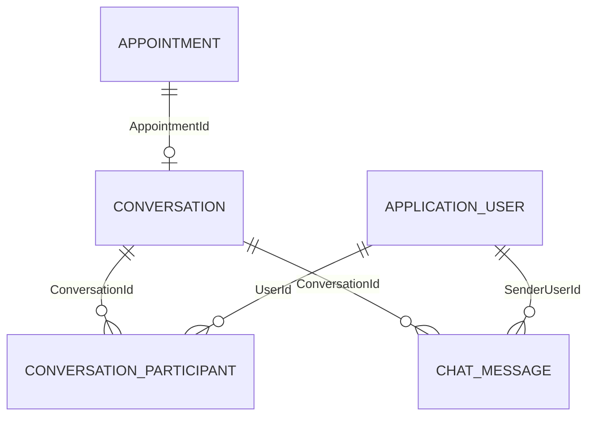

# MindBloom - Dokumentacija baze podataka

## 1. Izvori i opseg dokumentacije

Ovaj dokument opisuje trenutni EF Core model baze podataka za MindBloom. Source of truth su:

- `backend/src/MindBloom.Infrastructure/Persistence/Context/ApplicationDbContext.cs`
- entiteti u `backend/src/MindBloom.Domain/Entities/`
- enum tipovi u `backend/src/MindBloom.Domain/Enums/`
- EF Core migrations i `ApplicationDbContextModelSnapshot`

Dokumentacija ne prikazuje connection stringove, lozinke, Stripe/Firebase ključeve ili druge secret vrijednosti. Fokus je na poslovnom modelu, glavnim relacijama, PK/FK vezama, many-to-many modelima, unique constraintima i tehničkim tabelama koje su važne za razumijevanje sistema.

## 2. Pregled modela

MindBloom koristi SQL Server preko EF Core i ASP.NET Core Identity. `ApplicationDbContext` nasljeđuje:

```csharp
IdentityDbContext<ApplicationUser, IdentityRole<int>, int>
```

To znači da Identity korisnici i role koriste `int` primary key. Identity dio baze služi za autentikaciju, autorizaciju, role i sigurnosne podatke, dok domenski profili kao `Client` i `Therapist` modeluju poslovne uloge korisnika u sistemu.

Glavne grupe tabela su:

- Identity i korisnički profil: `AspNetUsers`, `AspNetRoles`, `AspNetUserRoles`, `Clients`, `Therapists`, `UserSettings`, `UserConsents`.
- Terapijski proces: `Appointments`, `AppointmentNotes`, `AppointmentStatusAudits`, `Reviews`, `ReviewModerationAudits`.
- Plaćanja i članarine: `Payments`, `MembershipPlans`, `ClientMemberships`, `MembershipPayments`, `MembershipUsages`.
- Chat i realtime persistence: `Conversations`, `ConversationParticipants`, `ChatMessages`.
- Notifikacije: `Notifications`, `FcmDeviceTokens`.
- Sadržaj i događaji: `Articles`, `ArticleCategories`, `Workshops`, `WorkshopRegistrations`.
- Mood/journal podaci: `MoodEntries`, `PrivateJournalEntries`.
- Recommendation/preference podaci: `TherapyApproaches`, `ClientTherapyApproaches`, `TherapistTherapyApproaches`, `TherapistSpecializations`, `Favorites` i preference kolone na `Clients`.
- Tehničke tabele: `OutboxMessages`, `ProcessedMessages`, `StripeWebhookEvents`, `ApiIdempotencyRecords`, audit logovi i sigurnosni tokeni.

## 3. Glavni business ER dijagram

Cardinality oznake u dijagramu prate trenutni EF model:

- `||` znači da je veza obavezna na toj strani.
- `o|` znači da je veza opcionalna i najviše jedan zapis.
- `o{` znači da može postojati nula ili više zapisa.

```mermaid
erDiagram
    APPLICATION_USER ||--o{ CLIENT : "UserId"
    APPLICATION_USER ||--o{ THERAPIST : "UserId"
    APPLICATION_USER ||--o| USER_SETTINGS : "UserId"
    APPLICATION_USER ||--o{ NOTIFICATION : "UserId"
    APPLICATION_USER ||--o{ FCM_DEVICE_TOKEN : "UserId"
    APPLICATION_USER ||--o{ ARTICLE : "AuthorUserId"
    APPLICATION_USER ||--o{ WORKSHOP : "OrganizerUserId"

    CLIENT ||--o{ APPOINTMENT : "ClientId"
    THERAPIST ||--o{ APPOINTMENT : "TherapistId"
    APPOINTMENT ||--o| PAYMENT : "AppointmentId"
    APPOINTMENT ||--o| REVIEW : "AppointmentId"
    APPOINTMENT ||--o| CONVERSATION : "AppointmentId"
    APPOINTMENT ||--o| MEMBERSHIP_USAGE : "AppointmentId"
    APPOINTMENT ||--o| APPOINTMENT_NOTE : "AppointmentId"
    APPOINTMENT ||--o{ APPOINTMENT_STATUS_AUDIT : "AppointmentId"
    APPOINTMENT o|--o{ NOTIFICATION : "AppointmentId"

    THERAPIST ||--o{ REVIEW : "TherapistId"
    CLIENT ||--o{ REVIEW : "ClientId"
    THERAPIST ||--o{ APPOINTMENT_NOTE : "TherapistId"

    CLIENT ||--o{ CLIENT_MEMBERSHIP : "ClientId"
    THERAPIST ||--o{ CLIENT_MEMBERSHIP : "TherapistId"
    CLIENT_MEMBERSHIP ||--o| MEMBERSHIP_PAYMENT : "ClientMembershipId"
    CLIENT_MEMBERSHIP ||--o{ MEMBERSHIP_USAGE : "ClientMembershipId"

    CONVERSATION ||--o{ CONVERSATION_PARTICIPANT : "ConversationId"
    APPLICATION_USER ||--o{ CONVERSATION_PARTICIPANT : "UserId"
    CONVERSATION ||--o{ CHAT_MESSAGE : "ConversationId"
    APPLICATION_USER ||--o{ CHAT_MESSAGE : "SenderUserId"

    CLIENT ||--o{ MOOD_ENTRY : "ClientId"
    CLIENT ||--o{ PRIVATE_JOURNAL_ENTRY : "ClientId"
    MOOD_ENTRY o|--o{ PRIVATE_JOURNAL_ENTRY : "MoodEntryId"

    THERAPIST o|--o{ ARTICLE : "TherapistId"
    ARTICLE_CATEGORY o|--o{ ARTICLE : "ArticleCategoryId"
    THERAPIST o|--o{ WORKSHOP : "TherapistId"
    WORKSHOP ||--o{ WORKSHOP_REGISTRATION : "WorkshopId"
    CLIENT ||--o{ WORKSHOP_REGISTRATION : "ClientId"
```


Napomena: `Client.UserId` i `Therapist.UserId` su FK prema `ApplicationUser`, ali su u trenutnoj Fluent API konfiguraciji mapirani sa `WithMany()` i bez eksplicitnog unique indexa na `UserId`. Poslovno predstavljaju domenske profile korisnika, ali dokumentacija ne tvrdi database-level 1:1 constraint ako on nije eksplicitno konfigurisan.

## 4. Identity i korisnici

`ApplicationUser` je Identity korisnik i mapira se na standardnu Identity tabelu `AspNetUsers`. Pošto DbContext koristi `IdentityRole<int>`, role su u `AspNetRoles`, a veza korisnik-role u `AspNetUserRoles`.

Relevantne Identity tabele uključuju standardni ASP.NET Core Identity set:

| Tabela | Svrha |
| --- | --- |
| `AspNetUsers` | Autentikacijski korisnik, osnovni profil, email, statusi i sigurnosna polja. |
| `AspNetRoles` | Role sistema. |
| `AspNetUserRoles` | Veza korisnika i rola. |
| `AspNetUserClaims` | Claimovi korisnika. |
| `AspNetRoleClaims` | Claimovi rola. |
| `AspNetUserLogins` | Eksterni login provider zapisi, ako se koriste. |
| `AspNetUserTokens` | Identity tokeni. |

Domenski profili su odvojeni:

| Entitet | PK | Glavni FK | Relacije | Poslovna svrha |
| --- | --- | --- | --- | --- |
| `ApplicationUser` / `AspNetUsers` | `Id` (`int`) | - | `UserSettings`, `UserConsents`, role, audit, tokens | Autentikacijski identitet korisnika. |
| `Client` / `Clients` | `Id` | `UserId -> AspNetUsers.Id` | appointments, memberships, mood entries, workshop registrations, preferences | Domenski profil klijenta. |
| `Therapist` / `Therapists` | `Id` | `UserId -> AspNetUsers.Id`, `SpecializationId -> TherapistSpecializations.Id` | appointments, reviews, articles, workshops, availability, documents, therapy approaches | Domenski profil terapeuta. |
| `UserSettings` / `UserSettings` | `Id` | `UserId -> AspNetUsers.Id` | 1:1 sa `ApplicationUser` | Korisničke preference za notifikacije, javnost profila i dijeljenje mood podataka. |
| `UserConsent` / `UserConsents` | `Id` | `UserId -> AspNetUsers.Id` | N:1 prema `ApplicationUser` | Evidencija prihvaćenih dokumenata/saglasnosti. |

`UserSettings.UserId` ima unique index. `UserConsents` ima unique index nad `(UserId, ConsentType, DocumentVersion)`.

## 5. Client, Therapist i preference model

`Client` sadrži podatke koji se koriste za onboarding i recommendation/preference logiku: lokaciju, preferirani spol terapeuta, tip sesije, minimalnu/maksimalnu cijenu, jezike, fokus oblasti procjene i preferirane dane. `Client` ima i kolekciju `PreferredTherapyApproaches` preko eksplicitnog join entiteta `ClientTherapyApproach`.

`Therapist` sadrži profesionalni profil: biografiju, cijenu, status verifikacije, iskustvo, lokaciju, online/in-person opcije, jezike, edukaciju, availability, dokumente i pristupe terapiji. `Therapist.SpecializationId` se opcionalno veže na referentnu tabelu `TherapistSpecializations`.

Preference/reference entiteti:

| Entitet/Tabela | PK | Glavni FK | Relacije | Svrha |
| --- | --- | --- | --- | --- |
| `TherapyApproach` / `TherapyApproaches` | `Id` | - | N:M sa `Client` i `Therapist` preko join entiteta | Referentna tabela terapijskih pristupa. |
| `ClientTherapyApproach` / `ClientTherapyApproaches` | `Id` | `ClientId`, `TherapyApproachId` | `Client <-> TherapyApproach` | Preferirani terapijski pristupi klijenta. |
| `TherapistTherapyApproach` / `TherapistTherapyApproaches` | `Id` | `TherapistId`, `TherapyApproachId` | `Therapist <-> TherapyApproach` | Terapijski pristupi koje terapeut nudi. |
| `TherapistSpecialization` / `TherapistSpecializations` | `Id` | - | 1:N prema `Therapist` | Referentna tabela specijalizacija. |
| `Favorite` / `Favorites` | `Id` | `ClientId`, `TherapistId` | `Client <-> Therapist` | Favoriti klijenta prema terapeutima. |

`TherapyApproaches.Name`, `TherapistSpecializations.Name` i slične referentne vrijednosti imaju unique index filtriran sa `[IsDeleted] = 0`, što omogućava soft-delete varijante bez dupliranja aktivnih naziva.

## 6. Appointments, payments i reviews

`Appointment` je centralni poslovni entitet za terapijske termine. Veže klijenta i terapeuta, čuva vrijeme termina (`StartUtc`, `EndUtc`, `AppointmentDateUtc`), status, tip termina, cijenu, lokaciju ili link sastanka i indikator plaćanja.

| Entitet/Tabela | PK | Glavni FK | Relacije | Poslovna svrha |
| --- | --- | --- | --- | --- |
| `Appointment` / `Appointments` | `Id` | `ClientId`, `TherapistId` | N:1 prema `Client` i `Therapist`; 1:1 sa `Payment`, `Conversation`, `AppointmentNote`; 1:N status audits | Terapijski termin. |
| `Payment` / `Payments` | `Id` | `AppointmentId` | 1:1 prema `Appointment` | Plaćanje pojedinačnog termina, Stripe PaymentIntent i refund podaci. |
| `Review` / `Reviews` | `Id` | `ClientId`, `TherapistId`, `AppointmentId`, `ModeratedByUserId` | Review je vezan na appointment, klijenta i terapeuta | Ocjena/review nakon termina, uključujući moderaciju i odgovor terapeuta. |
| `AppointmentNote` / `AppointmentNotes` | `Id` | `AppointmentId`, `TherapistId` | Bilješke terapeuta za termin | Terapijske bilješke, mood i preporuke nakon termina. |
| `AppointmentStatusAudit` / `AppointmentStatusAudits` | `Id` | `AppointmentId`, `ChangedByUserId` | Historija promjena statusa appointmenta | Audit trail status tranzicija. |

Važni constrainti:

- `Appointments` ima index `IX_Appointments_Therapist_SlotLookup` nad `(TherapistId, StartUtc, EndUtc, Status)` za provjeru termina terapeuta.
- `Payments.AppointmentId` je unique, pa jedan appointment ima najviše jedan payment zapis.
- `Payments.StripePaymentIntentId` je unique.
- `Payments.StripeRefundId` je unique samo kada nije null.
- `Reviews.AppointmentId` je unique sa filterom `[IsDeleted] = 0`, pa aktivni appointment može imati najviše jedan aktivni review.

## 7. Membership model

Membership dio razlikuje plan, kupljenu članarinu i payment zapis:

| Entitet/Tabela | PK | Glavni FK | Relacije | Poslovna svrha |
| --- | --- | --- | --- | --- |
| `MembershipPlan` / `MembershipPlans` | `Id` | - | 1:N prema `MembershipPlanAudit` | Referentni plan članarine: tip, cijena, trajanje, broj sesija i benefiti. |
| `ClientMembership` / `ClientMemberships` | `Id` | `ClientId`, `TherapistId` | N:1 prema klijentu i terapeutu; 1:1 sa `MembershipPayment`; 1:N prema `MembershipUsage` | Kupljena/aktivna članarina klijenta kod terapeuta. |
| `MembershipPayment` / `MembershipPayments` | `Id` | `ClientMembershipId` | 1:1 prema `ClientMembership` | Stripe payment zapis za membership kupovinu. |
| `MembershipUsage` / `MembershipUsages` | `Id` | `ClientMembershipId`, `AppointmentId` | Sesija potrošena ili rezervisana kroz membership | Evidencija korištenja membership sesija. |
| `MembershipPlanAudit` / `MembershipPlanAudits` | `Id` | `MembershipPlanId`, `ChangedByUserId` | Audit promjena planova | Administrativni audit membership planova. |

Važni constrainti:

- `MembershipPlans` ima unique index nad `(PlanType, IsDeleted)` sa filterom `[IsDeleted] = 0`.
- `MembershipPayments.ClientMembershipId` je unique.
- `MembershipPayments.StripePaymentIntentId` je unique.
- `MembershipUsages.AppointmentId` je unique, pa jedan appointment može biti povezan sa najviše jednim membership usage zapisom.
- `ClientMemberships` ima indexe nad `(ClientId, TherapistId, IsActive)` i `(ClientId, TherapistId, PlanType, IsDeleted)`.

## 8. Conversation i chat model

Chat persistence je vezan za appointment:



| Entitet/Tabela | PK | Glavni FK | Relacije | Svrha |
| --- | --- | --- | --- | --- |
| `Conversation` / `Conversations` | `Id` | `AppointmentId` | 1:1 sa appointmentom | Chat kontekst za terapijski termin. |
| `ConversationParticipant` / `ConversationParticipants` | `Id` | `ConversationId`, `UserId` | Join tabela između conversation-a i korisnika | Učesnici razgovora, `LastReadAtUtc`, aktivnost. |
| `ChatMessage` / `ChatMessages` | `Id` | `ConversationId`, `SenderUserId` | Poruke unutar conversation-a | Tekst poruke, vrijeme slanja, edit status i client-side idempotency ID. |

Važni constrainti:

- `Conversations.AppointmentId` je unique.
- `ConversationParticipants` ima unique index nad `(ConversationId, UserId)`.
- `ChatMessages` ima unique index nad `(ConversationId, ClientMessageId)` kada je `ClientMessageId` not null.
- Poruke imaju indexe za čitanje po conversation-u i vremenu slanja.

## 9. Notifications i FCM tokens

`Notification` je SQL persistence model za notifikacije korisnika. Veže se na `ApplicationUser` i opcionalno na `Appointment`. Čuva naslov, poruku, read/unread status, vrijeme slanja, `ActionType` i opcioni `ResourceId`.

`FcmDeviceToken` čuva FCM tokene uređaja po korisniku. `Token` ima unique index, a postoje i indexi za `(UserId, IsActive, IsDeleted)` i `DeviceId`. Ovo omogućava da baza bude evidencija registrovanih uređaja i stanja tokena, dok delivery mehanizam može koristiti Firebase/FCM.

## 10. Articles i workshops

| Entitet/Tabela | PK | Glavni FK | Relacije | Poslovna svrha |
| --- | --- | --- | --- | --- |
| `Article` / `Articles` | `Id` | `AuthorUserId`, `TherapistId`, `ArticleCategoryId` | Autor je `ApplicationUser`; opciono vezano za terapeuta i kategoriju | Edukativni sadržaj. |
| `ArticleCategory` / `ArticleCategories` | `Id` | - | 1:N prema `Article` | Referentna kategorija članaka. |
| `Workshop` / `Workshops` | `Id` | `OrganizerUserId`, `TherapistId`, `StatusChangedByUserId` | Organizator, opcioni terapeut, registracije | Grupni događaj/radionica. |
| `WorkshopRegistration` / `WorkshopRegistrations` | `Id` | `WorkshopId`, `ClientId` | Join između workshopa i klijenta | Registracija klijenta na workshop. |

Važni constrainti:

- `ArticleCategories.Name` je unique sa filterom `[IsDeleted] = 0`.
- `Articles` imaju indexe nad kategorijom, publish statusom i `PublishedAtUtc`.
- `WorkshopRegistrations` ima unique index nad `(WorkshopId, ClientId)`, pa se klijent ne može duplo registrovati za isti workshop.
- `Workshops` imaju indexe nad `StartUtc` i `(Status, IsDeleted)`.

## 11. Journal, mood i emotional tracking

`MoodEntry` i `PrivateJournalEntry` čuvaju emocionalne podatke klijenta:

| Entitet/Tabela | PK | Glavni FK | Relacije | Poslovna svrha |
| --- | --- | --- | --- | --- |
| `MoodEntry` / `MoodEntries` | `Id` | `ClientId` | N:1 prema `Client` | Historija raspoloženja, emotion label i napomene. |
| `PrivateJournalEntry` / `PrivateJournalEntries` | `Id` | `ClientId`, opcioni `MoodEntryId` | N:1 prema `Client`, opcioni link na mood entry | Privatni journal zapis klijenta. |

`MoodEntries` imaju index nad `(ClientId, CreatedAtUtc, IsDeleted)`. `PrivateJournalEntries` imaju indexe nad `(ClientId, EntryDateUtc)` i `(ClientId, IsDeleted)`. `PrivateJournalEntry.MoodEntryId` koristi `DeleteBehavior.SetNull`, pa journal zapis može ostati i ako mood entry više nije vezan.

## 12. Many-to-many veze

U trenutnom EF modelu many-to-many veze su modelovane eksplicitnim join entitetima:

| Entity A | Join entity/table | Entity B | Constraint |
| --- | --- | --- | --- |
| `Conversation` | `ConversationParticipant` | `ApplicationUser` | Unique `(ConversationId, UserId)` |
| `Client` | `ClientTherapyApproach` | `TherapyApproach` | Unique `(ClientId, TherapyApproachId)` |
| `Therapist` | `TherapistTherapyApproach` | `TherapyApproach` | Unique `(TherapistId, TherapyApproachId)` |
| `Client` | `Favorite` | `Therapist` | FK prema obje strane; koristi se kao poslovna favorite veza |
| `Workshop` | `WorkshopRegistration` | `Client` | Unique `(WorkshopId, ClientId)` |
| `ApplicationUser` | `AspNetUserRoles` | `IdentityRole<int>` | Standardna Identity role veza |

Nema implicitnog EF many-to-many mapiranja bez klase za glavne poslovne veze; join entiteti nose dodatna polja kao `IsDeleted`, `IsActive`, status, vrijeme registracije ili read state. `Favorite` je poslovna many-to-many/asocijativna veza između klijenta i terapeuta, ali trenutni EF model ne definiše unique constraint nad `(ClientId, TherapistId)`.

## 13. Pregled glavnih PK/FK relacija

| Entitet/Tabela | PK | Glavni FK | Relacije | Poslovna svrha |
| --- | --- | --- | --- | --- |
| `Clients` | `Id` | `UserId` | User -> client profile, appointments, memberships | Klijent u domenskom modelu. |
| `Therapists` | `Id` | `UserId`, `SpecializationId` | User -> therapist profile, availability, appointments | Terapeut u domenskom modelu. |
| `Appointments` | `Id` | `ClientId`, `TherapistId` | Centralna veza klijent-terapeut | Terapijski termin. |
| `Payments` | `Id` | `AppointmentId` | 1:1 appointment payment | Plaćanje termina. |
| `Reviews` | `Id` | `ClientId`, `TherapistId`, `AppointmentId` | Review termina/terapeuta | Ocjena i moderacija review-a. |
| `Notifications` | `Id` | `UserId`, `AppointmentId?` | Korisničke notifikacije | Persistence notifikacija. |
| `Conversations` | `Id` | `AppointmentId` | Chat kontekst appointmenta | Razgovor za termin. |
| `ChatMessages` | `Id` | `ConversationId`, `SenderUserId` | Poruke u conversation-u | Chat poruke. |
| `Workshops` | `Id` | `OrganizerUserId`, `TherapistId?` | Organizacija workshopa | Događaji/radionice. |
| `Articles` | `Id` | `AuthorUserId`, `TherapistId?`, `ArticleCategoryId?` | Edukativni sadržaj | Članci. |
| `MoodEntries` | `Id` | `ClientId` | Mood historija klijenta | Emotional tracking. |
| `PrivateJournalEntries` | `Id` | `ClientId`, `MoodEntryId?` | Privatni journal | Dnevnik klijenta. |
| `MembershipPlans` | `Id` | - | Plan članarine | Referentna tabela planova. |
| `ClientMemberships` | `Id` | `ClientId`, `TherapistId` | Kupljena članarina | Aktivno/prijašnje članstvo. |
| `MembershipPayments` | `Id` | `ClientMembershipId` | 1:1 payment za membership | Plaćanje članarine. |
| `MembershipUsages` | `Id` | `ClientMembershipId`, `AppointmentId` | Potrošnja sesije | Evidencija korištenja članarine. |

## 14. Pregled glavnih relacija

Ova tabela prikazuje iste centralne veze kao ER dijagram, ali u obliku koji je čitljiv i bez Mermaid renderovanja.

| Entitet A | Veza | Entitet B | FK / join entity | Poslovno značenje |
| --- | --- | --- | --- | --- |
| `ApplicationUser` | 1:N | `Client` | `Clients.UserId` | Identity korisnik može imati klijentski domenski profil; EF model nema unique constraint na `Client.UserId`. |
| `ApplicationUser` | 1:N | `Therapist` | `Therapists.UserId` | Identity korisnik može imati terapeutski domenski profil; EF model nema unique constraint na `Therapist.UserId`. |
| `ApplicationUser` | 1:0..1 | `UserSettings` | `UserSettings.UserId`, unique | Jedan korisnik ima najviše jedan settings zapis. |
| `ApplicationUser` | 1:N | `UserConsent` | `UserConsents.UserId` | Korisnik može imati više saglasnosti po tipu i verziji dokumenta. |
| `Client` | 1:N | `Appointment` | `Appointments.ClientId` | Klijent može rezervisati više termina. |
| `Therapist` | 1:N | `Appointment` | `Appointments.TherapistId` | Terapeut može imati više termina. |
| `Appointment` | 1:0..1 | `Payment` | `Payments.AppointmentId`, unique | Termin može imati jedan payment zapis za pojedinačno plaćanje. |
| `Appointment` | 1:0..1 | `Review` | `Reviews.AppointmentId`, unique filtered by `IsDeleted = 0` | Aktivni termin može imati najviše jedan aktivni review. |
| `Appointment` | 1:0..1 | `Conversation` | `Conversations.AppointmentId`, unique | Chat kontekst se otvara po terminu. |
| `Appointment` | 1:0..1 | `AppointmentNote` | `AppointmentNotes.AppointmentId`, unique | Terapeut može imati jedan set bilješki za termin. |
| `Appointment` | 1:0..1 | `MembershipUsage` | `MembershipUsages.AppointmentId`, unique | Termin može potrošiti jednu membership sesiju. |
| `Client` | 1:N | `ClientMembership` | `ClientMemberships.ClientId` | Klijent može imati više članarina kroz vrijeme. |
| `Therapist` | 1:N | `ClientMembership` | `ClientMemberships.TherapistId` | Članarina je vezana za terapeuta. |
| `ClientMembership` | 1:0..1 | `MembershipPayment` | `MembershipPayments.ClientMembershipId`, unique | Kupljena članarina može imati jedan Stripe payment zapis. |
| `ClientMembership` | 1:N | `MembershipUsage` | `MembershipUsages.ClientMembershipId` | Članarina se troši kroz više appointment sesija. |
| `Conversation` | 1:N | `ConversationParticipant` | `ConversationParticipants.ConversationId` | Razgovor ima učesnike. |
| `ApplicationUser` | 1:N | `ConversationParticipant` | `ConversationParticipants.UserId` | Korisnik učestvuje u razgovorima. |
| `Conversation` | 1:N | `ChatMessage` | `ChatMessages.ConversationId` | Razgovor sadrži poruke. |
| `ApplicationUser` | 1:N | `ChatMessage` | `ChatMessages.SenderUserId` | Korisnik šalje poruke. |
| `Client` | 1:N | `MoodEntry` | `MoodEntries.ClientId` | Klijent ima historiju raspoloženja. |
| `Client` | 1:N | `PrivateJournalEntry` | `PrivateJournalEntries.ClientId` | Klijent ima privatne journal zapise. |
| `MoodEntry` | 0..1:N | `PrivateJournalEntry` | `PrivateJournalEntries.MoodEntryId`, nullable | Journal zapis može biti povezan sa mood entry zapisom. |
| `Workshop` | N:M preko join entiteta | `Client` | `WorkshopRegistration` | Klijenti se registruju na radionice. |
| `Client` | N:M preko join entiteta | `TherapyApproach` | `ClientTherapyApproach` | Terapijski pristupi koje klijent preferira. |
| `Therapist` | N:M preko join entiteta | `TherapyApproach` | `TherapistTherapyApproach` | Terapijski pristupi koje terapeut nudi. |
| `Client` | N:M/asocijativno | `Therapist` | `Favorite` | Klijent označava terapeuta kao favorita. |

## 15. Unique constraints i važni indexi

| Entitet/Tabela | Constraint/Index | Svrha |
| --- | --- | --- |
| `ApiIdempotencyRecords` | Unique `IdempotencyKey` | Sprječava duplu obradu istog idempotentnog API zahtjeva. |
| `OutboxMessages` | Unique `EventId`; unique nullable `IdempotencyKey` | Idempotentno publikovanje događaja. |
| `ProcessedMessages` | Unique `(MessageId, ConsumerName)` | Worker/consumer ne obrađuje istu poruku dva puta za isti consumer. |
| `StripeWebhookEvents` | Unique `StripeEventId` | Idempotentna obrada Stripe webhook eventa. |
| `Payments` | Unique `StripePaymentIntentId`, `AppointmentId`, nullable `StripeRefundId` | Jedan payment intent, jedan payment po appointmentu, bez duplog refund ID-a. |
| `MembershipPayments` | Unique `ClientMembershipId`, `StripePaymentIntentId` | Jedno plaćanje po membership kupovini i jedinstven Stripe intent. |
| `MembershipUsages` | Unique `AppointmentId` | Jedan membership usage po appointmentu. |
| `Reviews` | Unique `AppointmentId` sa `[IsDeleted] = 0` | Jedan aktivan review po appointmentu. |
| `Conversations` | Unique `AppointmentId` | Jedan chat conversation po appointmentu. |
| `ConversationParticipants` | Unique `(ConversationId, UserId)` | Korisnik ne može biti dupli participant istog razgovora. |
| `ChatMessages` | Unique `(ConversationId, ClientMessageId)` kada nije null | Client-side idempotency za slanje poruka. |
| `WorkshopRegistrations` | Unique `(WorkshopId, ClientId)` | Nema duple registracije za isti workshop. |
| `ClientTherapyApproaches` | Unique `(ClientId, TherapyApproachId)` | Nema duple preference veze. |
| `TherapistTherapyApproaches` | Unique `(TherapistId, TherapyApproachId)` | Nema duple therapist-approach veze. |
| `UserSettings` | Unique `UserId` | Jedan settings zapis po korisniku. |
| `UserConsents` | Unique `(UserId, ConsentType, DocumentVersion)` | Jedna saglasnost po dokument verziji i tipu. |
| `FcmDeviceTokens` | Unique `Token` | FCM token nije dupliran kroz korisnike/uređaje. |
| `RefreshTokens` | Unique `TokenHash` | Sigurna rotacija refresh tokena. |
| `TwoFactorLoginChallenges` | Unique `ChallengeHash` | Jedinstven 2FA challenge. |
| `MembershipPlans` | Unique `(PlanType, IsDeleted)` sa `[IsDeleted] = 0` | Jedan aktivan plan po tipu. |
| `TherapyApproaches`, `TherapistSpecializations`, `ArticleCategories` | Unique `Name` sa `[IsDeleted] = 0` | Aktivni lookup nazivi su jedinstveni. |

## 16. Soft delete

Većina domenskih entiteta nasljeđuje `BaseEntity`, koji sadrži:

- `Id`
- `CreatedAtUtc`
- `UpdatedAtUtc`
- `IsDeleted`

Soft delete je zato modelovan kroz `IsDeleted`. U `ApplicationDbContext` nije pronađen globalni `HasQueryFilter` za automatsko izbacivanje soft-deleted redova. Umjesto toga, servisi i query-ji eksplicitno koriste uslove poput `!x.IsDeleted`, a određeni unique indexi koriste filter `[IsDeleted] = 0`.

To znači da je soft delete prisutan kao persistence pattern, ali nije globalno nametnut EF query filterom. Neki tehnički entiteti kao `OutboxMessage` i `ApiIdempotencyRecord` ne nasljeđuju `BaseEntity`, jer imaju vlastiti tehnički lifecycle.

## 17. Tehničke i infrastrukturne tabele

| Entitet/Tabela | Svrha |
| --- | --- |
| `OutboxMessages` | Čuva domenske/integracijske događaje prije publikovanja, uključujući status, pokušaje, grešku i dead-letter flag. |
| `ProcessedMessages` | Evidencija obrađenih poruka po consumeru, za idempotentnu obradu u worker toku. |
| `StripeWebhookEvents` | Evidencija Stripe webhook eventa i njihovog processing statusa. |
| `ApiIdempotencyRecords` | Čuva idempotency key, hash zahtjeva i cached response status/body za idempotentne API operacije. |
| `AdminAuditLogs` | Administrativni audit na nivou requesta/akcije. |
| `SecurityAuditLogs` | Sigurnosni događaji, pokušaji i rezultat operacije. |
| `UserAudits` | Audit promjena nad korisnikom. |
| `PaymentAdminAudits` | Audit administratorskih promjena nad payment zapisima. |
| `TherapistVerificationAudits` | Historija promjena verifikacije terapeuta. |
| `ReviewModerationAudits` | Historija moderacije review-a. |
| `AppointmentStatusAudits` | Historija promjene statusa appointmenta. |
| `RefreshTokens` | Sigurno čuvanje refresh token hash zapisa i session ID-a. |
| `PasswordResetCodes`, `EmailVerificationCodes`, `TwoFactorLoginChallenges` | Sigurnosni tokeni/kodovi za auth tokove. |

## 18. Recommendation-related podaci

Recommendation i matching podaci nisu modelovani kao jedna posebna tabela "Recommendation". Umjesto toga, input podaci su raspoređeni kroz postojeći domenski model:

- `Clients` čuva preferirane atribute: spol terapeuta, tip sesije, cjenovni raspon, jezike, fokus oblasti i preferirane dane.
- `ClientTherapyApproaches` povezuje klijenta sa terapijskim pristupima koje preferira.
- `TherapistTherapyApproaches` povezuje terapeuta sa pristupima koje nudi.
- `TherapistSpecializations` i `Therapists.SpecializationId` daju referentni podatak o specijalizaciji terapeuta.
- `Favorites` modeluje eksplicitni interes klijenta za terapeuta.
- `Reviews` i rating podaci daju historijski signal kvaliteta terapeuta.

Ovaj model omogućava matching kroz kombinaciju preference podataka klijenta, profesionalnih atributa terapeuta, availability/cijene i historijskih signala poput review-a.

## 19. Poslovna svrha modela

Baza nije samo tehnički skup tabela, nego podržava glavne tokove MindBloom aplikacije:

- Korisnički profili i role: Identity tabele čuvaju autentikaciju i role, dok `Client` i `Therapist` odvajaju domenske profile od login identiteta.
- Terapeuti i klijenti: `Clients`, `Therapists`, preference polja, specialization i therapy approach veze omogućavaju pretragu, onboarding i matching.
- Rezervacija termina: `Appointments` povezuje klijenta i terapeuta, čuva vrijeme, tip, status i kontekst termina.
- Plaćanja: `Payments` čuva Stripe podatke za pojedinačne termine, a `MembershipPayments` za članarine.
- Membership: `MembershipPlans`, `ClientMemberships` i `MembershipUsages` razdvajaju plan, kupovinu i stvarnu potrošnju sesija.
- Reviews: `Reviews` i `ReviewModerationAudits` omogućavaju ocjenjivanje terapeuta uz moderaciju i audit.
- Chat: `Conversations`, `ConversationParticipants` i `ChatMessages` čuvaju razgovor vezan za appointment i učesnike razgovora.
- Notifications: `Notifications` čuva korisničke notifikacije, a `FcmDeviceTokens` uređaje za push delivery.
- Workshops i articles: `Workshops`, `WorkshopRegistrations`, `Articles` i `ArticleCategories` podržavaju edukativni sadržaj i grupne događaje.
- Mood/journal tracking: `MoodEntries` i `PrivateJournalEntries` čuvaju emocionalnu historiju i privatne zapise klijenta.
- Recommendation preference data: preference kolone na `Clients`, therapy approach veze, favorites, specialization i review rating podaci daju ulaze za preporuke i matching.
- Integritet i pouzdanost: unique constrainti štite od duplih paymenta, webhooka, poruka, registracija i review zapisa, dok outbox/processed-message tabele podržavaju idempotentnu asinhronu obradu.
## 20. Sažetak za odbranu

Baza je organizovana oko Identity korisnika i domenskih profila `Client` i `Therapist`. `ApplicationUser` predstavlja autentikaciju i role, dok `Client` i `Therapist` nose poslovne podatke aplikacije.

Centralni poslovni tok ide preko `Appointments`: klijent zakazuje termin kod terapeuta, termin može imati payment, review, conversation/chat i audit historiju statusa. Plaćanja su odvojena za pojedinačne termine (`Payments`) i članarine (`MembershipPayments`), a Stripe identifikatori su zaštićeni unique constraintima.

Chat je persistence modelovan kroz `Conversation`, `ConversationParticipant` i `ChatMessage`, pri čemu je conversation vezan za appointment. Notifikacije se čuvaju u SQL bazi, a `FcmDeviceTokens` čuvaju uređaje za push delivery.

Membership model razlikuje plan (`MembershipPlan`), kupljenu članarinu (`ClientMembership`), payment (`MembershipPayment`) i potrošnju sesija (`MembershipUsage`). Workshop i article moduli imaju zasebne tabele i referentne kategorije/registracije.

Mood i journal dio čuva emocionalnu historiju klijenta kroz `MoodEntries` i `PrivateJournalEntries`. Recommendation podaci nisu jedna tabela, nego kombinacija client preference polja, therapy approach join tabela, specialization referenci, favorites i review ratinga.

Za pouzdanost i integracije postoje tehničke tabele: outbox, processed messages, Stripe webhook events, API idempotency records i audit logovi. Soft delete se koristi kroz `IsDeleted`, ali bez globalnog EF query filtera; zato servisi eksplicitno filtriraju aktivne zapise.


