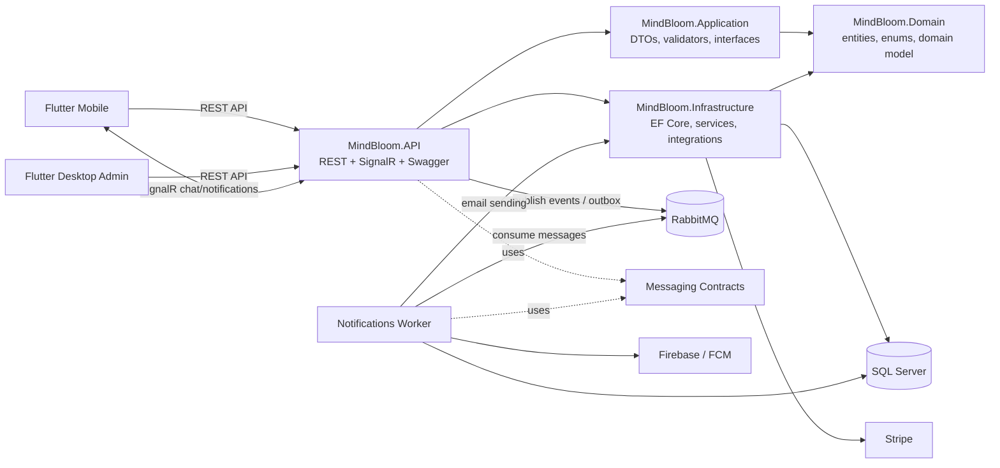
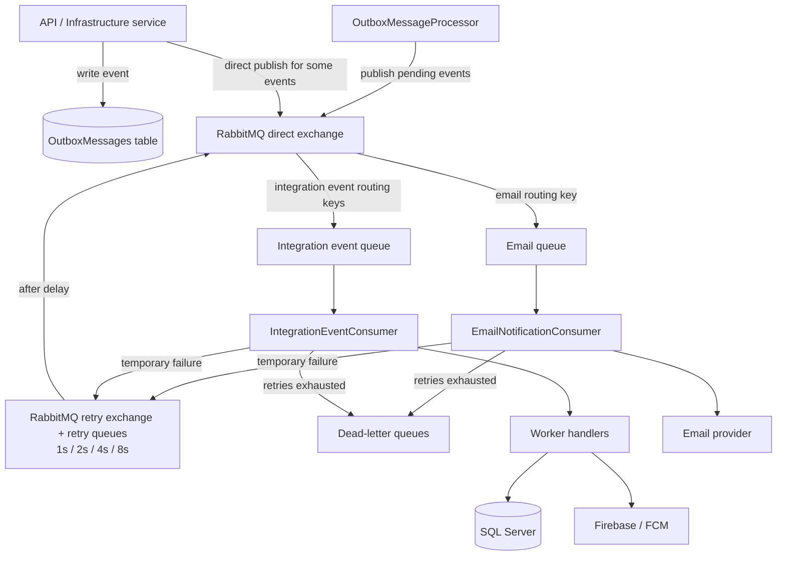
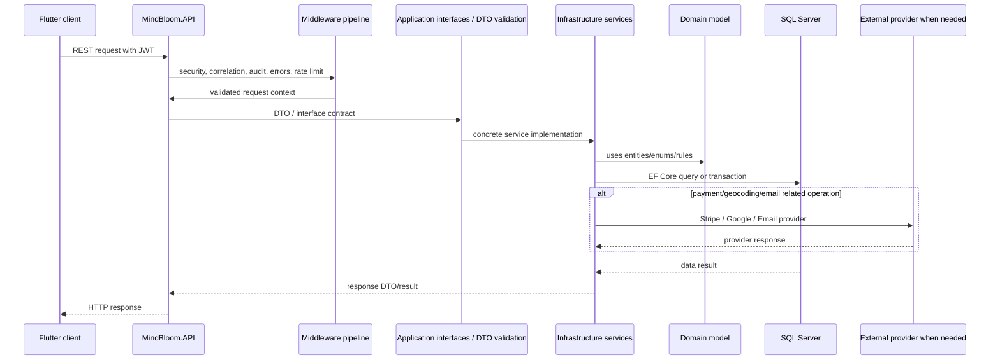
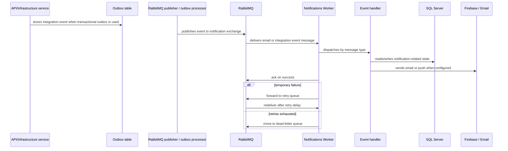
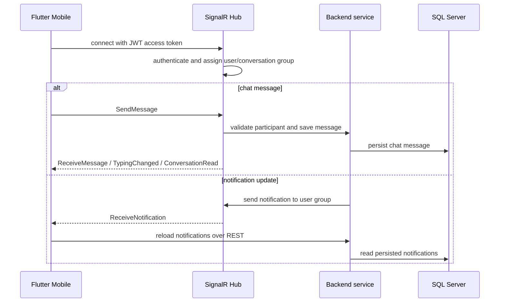

# MindBloom - Arhitektura sistema

## 1. Pregled sistema

MindBloom je sistem za podrsku procesu mentalnog zdravlja i terapijskih usluga. Sistem se sastoji od backend API-ja, zasebnog Notifications Workera, SQL Server baze, RabbitMQ brokera i dvije Flutter klijentske aplikacije:

- Flutter Mobile aplikacija za klijente i terapeute
- Flutter Desktop administrativni portal

Backend je organizovan kao viseslojna .NET aplikacija:

- `MindBloom.API` prima HTTP i SignalR zahtjeve, upravlja middleware pipeline-om i izlaže endpoint-e.
- `MindBloom.Application` sadrži DTO-e, validatore i interfejse za feature/use-case sloj.
- `MindBloom.Domain` sadrži entitete, enum-e i osnovne domenske koncepte.
- `MindBloom.Infrastructure` implementira persistence, servise, integracije i realtime infrastrukturu.
- `MindBloom.Messaging.Contracts` sadrži zajednicke message contract-e za API/publisher i Worker/consumer.
- `MindBloom.NotificationsWorker` je zaseban proces koji cita RabbitMQ poruke i izvrsava sporije ili asinhrone notification poslove.

Sistem koristi SQL Server za trajno cuvanje podataka, RabbitMQ za asinhronu komunikaciju, Stripe za placanja, Firebase Admin/FCM za push notifikacije, SignalR za realtime chat i notifikacije, te Docker Compose za lokalno/predajno backend okruzenje.

## 2. High-level arhitektura

Najvaznija arhitekturna podjela je izmedju sinhronog API zahtjeva i asinhrone obrade notifikacija. API treba brzo odgovoriti klijentu, dok Worker preuzima poslove koji ne moraju blokirati HTTP request, kao sto su email, push i domenske notifikacije nastale nakon dogadjaja.

## 3. Backend arhitektura

### 3.1 API

`MindBloom.API` je ASP.NET Core ulazna tacka sistema. U projektu se nalaze controllers, middleware-i, Swagger/OpenAPI konfiguracija, health checks, idempotency filteri i RabbitMQ publishing infrastruktura.

API sloj radi sljedece:

- izlaže REST endpoint-e kroz controllers
- mapira SignalR hub-ove na `/hubs/notifications` i `/hubs/chat`
- registruje JWT authentication i authorization pravila preko Infrastructure sloja
- koristi FluentValidation filter za validaciju request DTO-a
- standardizuje error response kroz `ApiErrorResponse`, `GlobalExceptionMiddleware` i status code pages
- dodaje sigurnosne headere, correlation id, request timing, admin audit i security audit middleware
- koristi rate limiting za osjetljive tokove kao sto su login, registration, refresh token, chat, uploads i recommendations
- izlaže health endpoint-e `/health/live` i `/health/ready`
- izlaže `/metrics` endpoint zasticen posebnim metrics key headerom
- u Development okruzenju izlaže Swagger UI

API ne sadrzi glavnu poslovnu logiku direktno u controllerima. Controlleri uglavnom uzimaju authenticated user id, pozivaju odgovarajuci service/interface i vracaju HTTP response.

### 3.2 Application

`MindBloom.Application` je feature-based sloj. Organizovan je po domenima aplikacije, npr. `Auth`, `Appointments`, `Payments`, `Memberships`, `Chat`, `Notifications`, `Admin`, `AdminReports`, `Articles`, `Workshops`, `Therapists`, `Reviews`, `Recommendations` i drugi.

U ovom sloju se nalaze:

- request/response DTO klase
- validator klase
- service interfejsi koje implementira Infrastructure
- zajednicki application modeli, izuzeci i helperi

U kodu nije vidljiv MediatR/CQRS pipeline kao centralni pattern. Umjesto toga, aplikacija koristi feature foldere, DTO-e, FluentValidation validatore i service interfejse. API zavisi od ovih interfejsa, a concrete implementacije dolaze iz `MindBloom.Infrastructure`.

### 3.3 Domain

`MindBloom.Domain` sadrzi centralne domenske entitete i enum-e. Primjeri domenskih koncepata su:

- korisnici, klijenti i terapeuti
- termini, dostupnost i appointment statusi
- placanja i membership paketi
- review-i, clanci i workshopi
- chat razgovori i poruke
- notifikacije i FCM device tokeni
- audit i security logovi
- Stripe webhook eventi, idempotency zapisi, outbox i processed messages

Domain sloj ne sadrzi infrastrukturu za bazu, RabbitMQ, Stripe ili Firebase. On definise model nad kojim rade Application i Infrastructure slojevi.

### 3.4 Infrastructure

`MindBloom.Infrastructure` implementira tehnicke detalje sistema:

- EF Core `ApplicationDbContext`
- SQL Server konfiguraciju i retry-on-failure
- ASP.NET Core Identity store
- JWT token servis i auth integraciju
- concrete application servise za appointments, payments, memberships, chat, admin, articles, workshops i druge feature-e
- Stripe client, PaymentIntent i webhook obradu
- SignalR hub-ove i notification sender
- email servis
- geocoding servis preko Google Maps API-ja
- FCM device token servis
- RabbitMQ konfiguraciju, connection factory, topology i outbox writer
- observability i metrics pomocne komponente

Infrastructure implementira interfejse iz Application sloja i povezuje ih sa stvarnim servisima, bazom i vanjskim providerima.

### 3.5 Shared

`MindBloom.Shared` sadrzi cross-cutting konstante, response modele i observability komponente koje se koriste u vise backend projekata. Primjeri su role/authorization konstante i `ApplicationMetrics`.

## 4. Persistence - SQL Server

MindBloom koristi SQL Server kao glavnu relacionu bazu. EF Core je primarni persistence mehanizam.

`ApplicationDbContext` nasljedjuje `IdentityDbContext<ApplicationUser, IdentityRole<int>, int>`, sto znaci da ista baza cuva i Identity korisnike/role i MindBloom domenske entitete.

U `ApplicationDbContext` postoje DbSet-ovi za, izmedju ostalog:

- `Clients`, `Therapists`, `Appointments`
- `Payments`, `MembershipPayments`, `ClientMemberships`
- `Notifications`, `FcmDeviceTokens`
- `Conversations`, `ConversationParticipants`, `ChatMessages`
- `Articles`, `Workshops`, `Reviews`
- `OutboxMessages`, `ProcessedMessages`
- `StripeWebhookEvents`
- audit i security entitete

Migrations se nalaze u `MindBloom.Infrastructure/Persistence/Migrations`. Docker Compose pokrece SQL Server servis, a API i Worker dobijaju connection string kroz environment varijable. Dokumentacija ne prikazuje stvarne lozinke ili connection string vrijednosti.

## 5. Asinhrona komunikacija

### 5.1 Messaging Contracts

`MindBloom.Messaging.Contracts` je zaseban .NET projekat koji sadrzi poruke koje dijele publisher i consumer. Time API i Worker ne moraju dijeliti concrete service klase, nego komuniciraju preko stabilnih message contract-a.

Contract kategorije postoje za:

- appointments
- articles
- chat
- memberships
- notifications
- payments
- reviews
- workshops
- common integration event bazu i routing keys

Primjeri contract-a su `AppointmentCreatedEvent`, `ChatMessageCreatedEvent`, `MembershipPurchasedEvent`, `PaymentSucceededEvent`, `PaymentRefundedEvent`, `NotificationRequestedEvent` i `EmailNotificationMessage`.

### 5.2 RabbitMQ

RabbitMQ se koristi za asinhronu obradu email i integration event poruka. Topologija se definise u `RabbitMqTopology`.

Stvarno implementirani elementi su:

- direct notification exchange
- email queue
- integration event queue
- retry exchange
- dead-letter exchange
- email dead-letter queue
- integration event dead-letter queue
- retry queue-evi sa odgodama 1s, 2s, 4s i 8s
- prefetch konfiguracija
- publisher i worker connection retry konfiguracija

API registruje `IIntegrationEventPublisher` kroz `RabbitMqIntegrationEventPublisher`, a notification publishing kroz `RabbitMqNotificationPublisher`. Za robusniju isporuku postoji i transactional outbox: `OutboxWriter` zapisuje poruke u bazu, a `OutboxMessageProcessor` ih kasnije objavljuje na RabbitMQ.

### 5.3 Notifications Worker

`MindBloom.NotificationsWorker` postoji kao zaseban proces da bi obradio poslove koji ne treba da blokiraju HTTP request:

- slanje email poruka
- kreiranje/obrada domenskih notifikacija
- slanje push notifikacija preko Firebase-a kada je konfigurisan
- obrada integration event-a za appointments, chat, memberships, payments, reviews, articles i workshops
- pracenje dead-letter queue stanja

Worker koristi iste `MindBloom.Messaging.Contracts` tipove kao API. U `Program.cs` registruje:

- `EmailNotificationConsumer`
- `IntegrationEventConsumer`
- `IntegrationEventDispatcher`
- handlere za pojedinacne event tipove
- `RabbitMqMonitoringService`
- `RabbitMqConsumerOperations`
- `WorkerNotificationService`
- `ProcessedMessageService`
- Firebase ili no-op push service, zavisno od konfiguracije

Worker ima vlastite `/health/live`, `/health/ready` i `/metrics` endpoint-e. Docker Compose ga pokrece kao odvojen servis `notifications-worker`.

### 5.4 Retry i dead-letter obrada

RabbitMQ retry flow je implementiran kroz retry exchange i retry queue-eve. Kada obrada poruke ne uspije, Worker moze proslijediti poruku u retry queue sa headerima kao sto su `x-retry-count`, `x-last-failure-reason`, `x-last-failure-at-utc` i `x-original-queue`.

Nakon isteka TTL-a retry queue vraca poruku nazad na glavni exchange i originalni routing key. Ako se dostigne maksimalni broj retry pokusaja, poruka ide u odgovarajuci dead-letter flow.

`DeadLetterQueueMonitor` periodično provjerava email i integration event DLQ i loguje upozorenje ako queue sadrzi poruke.

## 6. Frontend aplikacije

### 6.1 Flutter Mobile

`frontend/mindbloom_mobile` je Flutter aplikacija za klijente i terapeute. Struktura je organizovana kroz:

- `app` za DI, router i theme
- `core` za network, constants, validation, UI helpers i reusable widgets
- `features` za funkcionalne module
- `services` za session/runtime storage

Mobile koristi REST API preko `ApiClient`. Base URL se konfiguriše preko `API_BASE_URL` dart-define vrijednosti, a default za Android emulator je `http://10.0.2.2:5110`. JWT access token se cuva preko `flutter_secure_storage`, a `ApiClient` salje `Authorization: Bearer ...` header.

Mobile stvarno koristi:

- `signalr_netcore` za chat hub i notification hub
- `flutter_stripe` za Stripe PaymentSheet kod appointment i membership placanja
- `shared_preferences` za neke runtime preference
- REST API servise po feature modulima

Realtime chat koristi `/hubs/chat`, poziva hub metode kao sto su `JoinConversation`, `SendMessage`, `SetTyping` i `MarkAsRead`, te slusa evente `ReceiveMessage`, `TypingChanged` i `ConversationRead`.

Realtime notifikacije koriste `/hubs/notifications` i event `ReceiveNotification`. Mobile nakon realtime dogadjaja ponovo ucitava notifikacije preko zasticenog REST endpointa, tako da baza ostaje izvor istine za ID, `IsRead` i `CreatedAtUtc`.

### 6.2 Flutter Desktop

`frontend/mindbloom_desktop` je Flutter administrativni portal. Kod potvrđuje module za:

- dashboard
- users
- therapist verification
- appointment management
- payment management
- membership management
- review moderation
- article management
- workshop management
- reference data
- reports
- admin audit
- auth/session/settings

Desktop koristi REST API kroz vlastiti `ApiClient`, a access token cuva u `flutter_secure_storage`. Default API base URL je `http://localhost:8080`, uz mogucnost konfiguracije preko `API_BASE_URL`.

Desktop kod ne koristi Flutter Stripe SDK. On administrativno prikazuje Stripe reference i pokrece backend admin/refund tokove kroz API.

## 7. Vanjske integracije

### 7.1 Stripe

Stripe integracija je implementirana na backendu u `MindBloom.Infrastructure.Payments` i povezanim servisima.

Backend odgovornosti:

- konfiguracija `StripeClientProvider`
- kreiranje PaymentIntent-a za appointment i membership placanja
- potvrda placanja prema backend stanju
- refund flow za placanja
- webhook endpoint `/api/stripe/webhook`
- signature validation kroz Stripe `EventUtility.ConstructEvent`
- cuvanje `StripeWebhookEvent` zapisa radi duplicate/idempotent obrade
- publish payment event-a prema RabbitMQ/Worker toku

Mobile odgovornosti:

- ucitava publishable key kroz `STRIPE_PUBLISHABLE_KEY`
- koristi `flutter_stripe`
- inicijalizuje i prikazuje PaymentSheet
- nakon uspjeha komunicira sa backend payment/membership endpointima

Dokumentacija ne sadrzi Stripe secret key, webhook secret niti stvarne credential vrijednosti.

### 7.2 Firebase

Firebase se koristi na backend Worker strani za push notifikacije preko Firebase Admin SDK-a.

Stvarno stanje u kodu:

- Worker cita `FIREBASE_CREDENTIALS_PATH`
- ako kredencijali nisu dostupni i nije Testing okruzenje, Worker nastavlja rad sa no-op push servisom
- `FirebasePushNotificationService` koristi Firebase Admin/FCM za slanje push notifikacija
- `FcmDeviceTokenService` i `FcmDeviceTokensController` podrzavaju registraciju device tokena
- konfiguracija ukljucuje batch size, retry count i retry delay

Firebase nije sinhroni dio API request flow-a. U praksi je vezan za Worker notification processing.

### 7.3 SignalR / realtime komunikacija

SignalR je implementiran u `MindBloom.Infrastructure.Realtime`.

Postoje dva hub-a:

- `NotificationHub`, mapiran na `/hubs/notifications`
- `ChatHub`, mapiran na `/hubs/chat`

Oba hub-a zahtijevaju autorizaciju. JWT za SignalR moze doci kroz query string `access_token` za hub path-ove. Mobile klijent koristi `signalr_netcore` i `accessTokenFactory`, tako da realtime konekcija koristi isti session token kao REST API.

Notification hub dodaje konekciju u grupu `user-{userId}`. Chat hub koristi conversation grupe `conversation-{conversationId}` i provjerava da je korisnik participant prije pristupa razgovoru.

## 8. Docker i deployment struktura

`docker-compose.yml` definise backend okruzenje kroz sljedece servise:

- `sql-server`
- `rabbitmq`
- `api`
- `notifications-worker`

SQL Server i RabbitMQ imaju volume-e za persistent data. API i Worker se buildaju iz root build contexta preko svojih Dockerfile-a:

- `backend/src/MindBloom.API/Dockerfile`
- `backend/src/MindBloom.NotificationsWorker/Dockerfile`

Oba Dockerfile-a koriste multi-stage build:

1. restore
2. build
3. publish
4. runtime

API i Worker runtime image koriste `mcr.microsoft.com/dotnet/aspnet:9.0`, izlažu port 8080 i imaju Docker healthcheck. Compose povezuje servise preko `mindbloom-network`, a API i Worker zavise od zdravih SQL Server i RabbitMQ servisa.

## 9. Communication flows

### 9.1 Request flow

Ovaj flow opisuje tipican sinhroni REST zahtjev. Ne znaci da svaki endpoint koristi vanjski provider; vanjske integracije su ukljucene samo u relevantnim use-case-ovima.

### 9.2 Async messaging flow

### 9.3 Realtime flow

## 10. Ključne arhitekturne odluke

### Odvojeni API i Notifications Worker

Worker postoji zato sto email, push i notification event processing ne moraju biti dio sinhronog HTTP odgovora. Time API moze zavrsiti request nakon sto sacuva poslovno stanje i objavi event, dok Worker kasnije obradjuje poruku.

Ova odluka je posebno korisna za:

- slanje emailova
- push notifikacije
- notification side-effecte poslije placanja, termina, chat poruka, workshopa i slicnih dogadjaja
- retry i DLQ bez ponavljanja korisnickog HTTP requesta

### Messaging contracts kao stabilna granica

API i Worker dijele samo contract projekte i routing keys, a ne concrete service implementacije. To smanjuje coupling i olaksava razumijevanje poruka koje prolaze kroz RabbitMQ.

### SQL Server kao izvor istine

REST i realtime tokovi ne tretiraju SignalR poruku kao trajno stanje. Podaci se cuvaju u SQL Server bazi, a realtime poruke sluze za brzu obavijest klijenta da se stanje promijenilo.

### Stripe je backend-kontrolisana integracija

Mobile koristi Stripe SDK za korisnicki payment sheet, ali backend kreira PaymentIntent, cuva payment state, obradjuje webhook i provjerava signature. Secret key i webhook secret ostaju na serveru.

### Firebase je opcionalno povezan kroz Worker

Ako Firebase credential path nije konfigurisan ili fajl ne postoji, Worker nastavlja rad sa no-op push servisom. To znaci da sistem moze obraditi ostale notification tokove i bez aktivne Firebase konfiguracije.

## 11. Sažetak za odbranu

MindBloom je podijeljen na backend, mobile aplikaciju, desktop admin portal i infrastrukturu. Backend je .NET sistem sa slojevima API, Application, Domain i Infrastructure. API prima REST i SignalR zahtjeve, validira ih, primjenjuje auth/rate limiting/middleware i poziva servise. Application definise DTO-e, validatore i interfejse, Domain sadrzi entitete i enum-e, a Infrastructure implementira bazu, servise i integracije.

SQL Server je glavna baza i koristi se preko EF Core `ApplicationDbContext`. Flutter Mobile koristi REST API, JWT session, SignalR chat/notifikacije i Stripe PaymentSheet. Flutter Desktop je administrativni portal za upravljanje korisnicima, terapeutima, appointmentima, placanjima, membershipima, reviewima, clancima, workshopima, reference data i izvjestajima.

Notifications Worker je zaseban servis zato sto notification poslovi nisu dio brzog request/response toka. API objavljuje evente na RabbitMQ, a Worker ih cita, dispatcha handlerima i salje email, push ili kreira notifikacije. RabbitMQ ima retry i dead-letter mehanizam, pa privremeni problemi ne moraju odmah prekinuti korisnicki request.

Stripe je integrisan tako da backend kreira i potvrdjuje placanja, a webhook endpoint validira Stripe signature i idempotentno obradjuje evente. Firebase/FCM se koristi iz Workera za push notifikacije kada su kredencijali dostupni. SignalR daje realtime chat i notification update-e, dok SQL Server ostaje izvor istine.

Docker Compose povezuje SQL Server, RabbitMQ, API i Notifications Worker u jedno backend okruzenje sa health checkovima, mrežom i persistent volume-ima.
